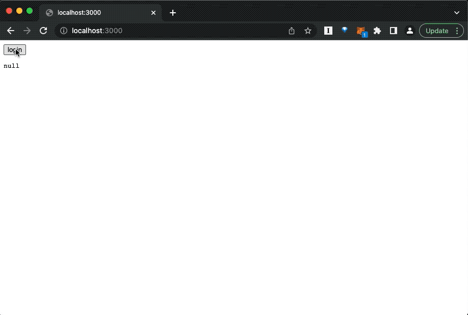
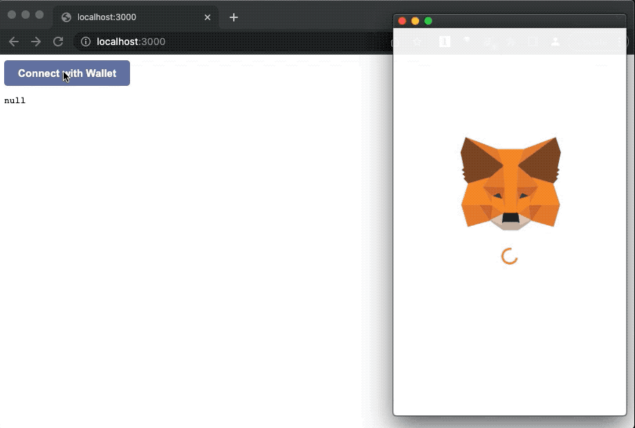
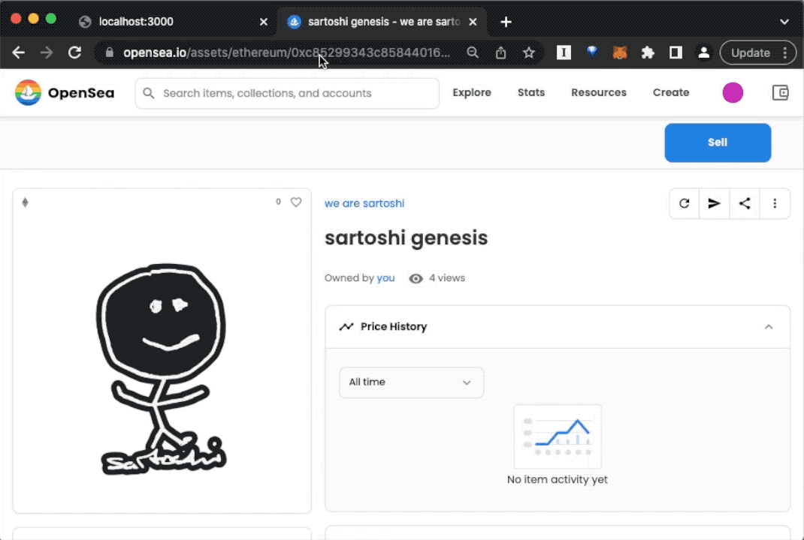

# nextparty

[Partybutton](https://partybutton.papercorp.org/) demo for next.js

# Setup

First clone this repository and install dependencies

```
git clone https://github.com/privatepart/nextparty.git
cd nextparty
npm install
```

# Usage

## 1. Simple auth

Basic button with no styling:



Run:

```
npm run simple
```

This will launch both the privateparty server (an express app at port 4200) and a next.js dev server (at port 3000)

1. Client code: [simple/client](simple/client)
2. Server code: [simple/server](simple/server)

> **NOTE**
>
> Since the privateparty server and the next.js dev server are running on different ports during development and will cause CORS issues, we utilize the [next.js rewrites](https://www.edmondchuc.com/blog/next-js-development-proxy-server) feature to proxy the 4 private party endpoints, as you can see at [simple/client/next.config.js](simple/client/next.config.js). This issue only exists in dev environment because you're running a dev server. In production, frontend code and the backend will be hosted on the same domain so no cors issues.


## 2. Custom auth

Same as Simple auth, but shows how the buttons can be custom styled:



```
npm run custom
```

This will launch both the privateparty server (an express app at port 4200) and a next.js dev server (at port 3000)

1. Client code: [custom/client](custom/client)
2. Server code: [custom/server](custom/server)

> **NOTE**
>
> Since the privateparty server and the next.js dev server are running on different ports during development and will cause CORS issues, we utilize the [next.js rewrites](https://www.edmondchuc.com/blog/next-js-development-proxy-server) feature to proxy the 4 private party endpoints, as you can see at [custom/client/next.config.js](simple/client/next.config.js). This issue only exists in dev environment because you're running a dev server. In production, frontend code and the backend will be hosted on the same domain so no cors issues.


## 3. Payload auth

This app demonstrates how the Partybutton can be used to pass additional payload data to the Privateparty server.

In this case we pass 2 attributes: `contract` and `tokenId`:



Before we run, you must set the environment variable first because we will be using the Alchemy JSON-RPC API to query the blockchain for authorization.

1. First go to Alchemy (sign up if you haven't at https://www.alchemy.com/) and get the RPC URL
2. In the root folder, create a file named `.env` and save: `RPC=<YOUR ALCHEMY API ENDPOINT>`
3. Then run: `npm run payload`

This app lets you "login with your NFT" by providing the contract address and the tokenId.

1. Client code: [payload/client](payload/client)
2. Server code: [payload/server](payload/server)

> **NOTE**
>
> Since the privateparty server and the next.js dev server are running on different ports during development and will cause CORS issues, we utilize the [next.js rewrites](https://www.edmondchuc.com/blog/next-js-development-proxy-server) feature to proxy the 4 private party endpoints, as you can see at [payload/client/next.config.js](simple/client/next.config.js). This issue only exists in dev environment because you're running a dev server. In production, frontend code and the backend will be hosted on the same domain so no cors issues.

